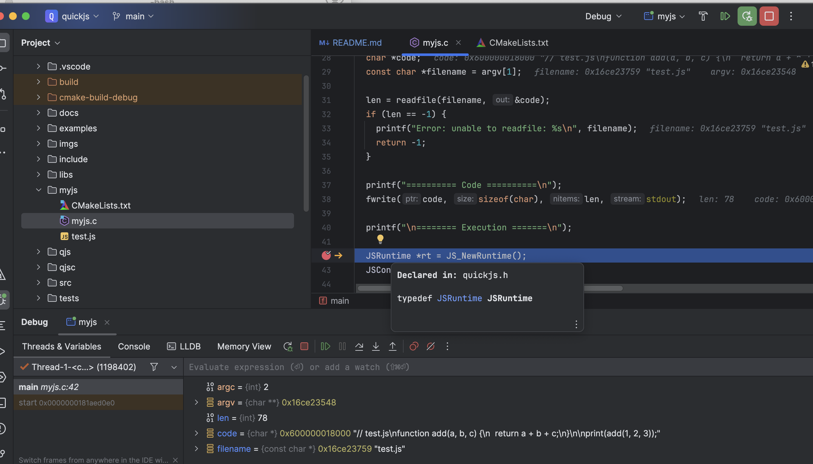

## SlowJS

SlowJS - QuickJS is quick but I can make it slow!

Learning the awesome [QuickJS](https://github.com/bellard/quickjs/blob/2788d71e823b522b178db3b3660ce93689534e6d/quickjs.c) by extending it with below functionalities:

- [x] Divide the 5.4W LoC [quickjs.c](https://github.com/bellard/quickjs) into multiple small files, makes the code easy to browser and navigate
- [x] A debugger which supports inline breakpoints and includes web interfaces which is easy to integrate with the [Debug Adapter Protocol](https://microsoft.github.io/debug-adapter-protocol/)
- [x] Dump the GC managed objects and view the results in the Chrome devtools

## Debugger

The debugger can be tasted by following steps:

<details>
  <summary>Click to expand</summary>

1. Build our SlowJS:

    ```bash
    cmake -S . --preset=default
    cmake --build --preset=qjs
    ```

   the location of the built stuff is `./build/qjs/qjs`

2. Make up a file `tmp_test.js` to test:

    ```js
    function add(a, b) {
      const c = a + b;
      return c;
    }

    function sub(a, b) {
      const c = a - b;
      return c;
    }

    function doSth(a, b) {
      return add(a, b) + sub(a, b);
    }

    print(doSth(1, 2));
    ```

3. Start the debugger:

    ```bash
    ./build/qjs/qjs --debug 8097
    ```

3. Connect to the debugger:

    ```bash
    nc 0.0.0.0 8097
    ```

   We use `nc` to communicate with the debugger server, then we can paste come commands to perform debug

4. Call the debugger to launch a new session:

    ```json
    { "type": "launch", "data": { "file": "./tmp_test.js" } }
    ```

   Paste above json into the `nc` REPL and press `ENTER`

5. Set breakpoints:

    ```json
    {
      "type": "setBreakpoint",
      "data": { "file": "./tmp_test.js", "line": 3, "col": 0 }
    }
    ```

    ```json
    {
      "type": "setBreakpoint",
      "data": { "file": "./tmp_test.js", "line": 8, "col": 0 }
    }
    ```

6. Start to run our test script:

    ```json
    { "type": "run" }
    ```

7. Now the debugger is paused at the first breakpoint, we can list the stack frames:

    ```json
    { "type": "listStackframes" }
    ```

   the output looks like:

    ```json
    {
      "type": "listStackframes",
      "data": [
        {
          "name": "add",
          "file": "./tmp_test.js",
          "line": 1
        },
        {
          "name": "doSth",
          "file": "./tmp_test.js",
          "line": 11
        },
        {
          "name": "<eval>",
          "file": "./tmp_test.js",
          "line": 1
        }
      ]
    }
    ```

8. We can resume the debugger by issuing below command:

    ```json
    { "type": "continue" }
    ```

9. Now the debugger is paused at the second breakpoint, we can print the variable in the topmost stack frame:

    ```json
    { "type": "dumpStackframe", "data": { "i": 0 } }
    ```

   the output looks like:

    ```json
    {
      "type": "dumpStackframe",
      "data": {
        "args": [
          {
            "name": "a",
            "value": 1
          },
          {
            "name": "b",
            "value": 2
          }
        ],
        "vars": [
          {
            "name": "c",
            "value": -1
          }
        ],
        "closure_vars": [],
        "name": "sub",
        "file": "./tmp_test.js",
        "line": 6
      }
    }
    ```

10. We can use the `continue` command resume the debugger again:

    ```json
    { "type": "continue" }
    ```

11. Now the test script is done and the debugger server prints the final results:

    ```bash
    new sess thread is running...
    2
    ```

</details>

## GC Dump

The GC dump functionality can be tasted by following steps:

<details>
  <summary>Click to expand</summary>

1. Build our SlowJS:

    ```bash
    cmake -S . --preset=default
    cmake --build --preset=qjs
    ```

   the location of the built stuff is `./build/qjs/qjs`

2. Make up a file `tmp_test.js` to test:

    ```js
    var o = {
      a: { a1: { a2: 1 } },
      b: { b1: { b2: 1 } },
      c: function () {
        return 1;
      },
      d: new ArrayBuffer((1 << 20) * 50, 0),
      e: new Uint16Array((1 << 20) * 50, 0),
    };

    __js_gcdump_objects();
    print(o); // retain the obj to prevent it from being freed
    ```

3. Run the test script:

    ```bash
    ./build/qjs/qjs tmp_test.js
    ```

4. The output file will have name looks like:

    ```
    Heap.20230318.130209.224.heapsnapshot
    ```
   the filename is in this pattern:

    ```
    Heap.date.time.ms.heapsnapshot
    ```

5. Import the output file into Chrome devtools:

   

6. Then we can dig into the heap:

   

</details>

## Development

It's better to glance over the available options before you perform the actual build:

```bash
cmake -B build -LH
```

> - `-B` stands for the building directory
> - `-L` stands for listing all the options
> - `-H` stands for printing the help messages along with the options

above command will print the available options and their help messages, use them like this:

```bash
cmake -B build -S . -G Ninja -D QJS_DUMP_BYTECODE=1
```

> - `-S` stands for the source directory
> - `-D` stands for specifying an options in a `key=value` pattern

then choose one of below sections to run in project root directory

#### Debug build

```bash
cmake -S . --preset=default
cmake --build --preset=qjs
```

#### Release build

```bash
cmake -S . --preset=default -D CMAKE_BUILD_TYPE=Release
cmake --build --preset=qjs
```

#### Tests

```bash
cmake -S . --preset=default
cmake --build --preset=run-tests
```

#### Microbench

```bash
cmake -S . --preset=default -D CMAKE_BUILD_TYPE=Release
cmake --build --preset=run-microbench
```

#### Test262

```bash
cmake -S . --preset=default -D CMAKE_BUILD_TYPE=Release
cmake --build --preset=run-test262

# Result: 302/75790 errors, 1396 excluded, 7712 skipped, 302 new
```

### Presets

You can also choose the presets listed in `CMakePresets.json` to run:

```bash
# Use a config preset
cmake -S . --preset=default

# Use a build preset
cmake --build --preset=run-tests

# Link your own JS
cmake --build --preset=myjs
```

### Debug



